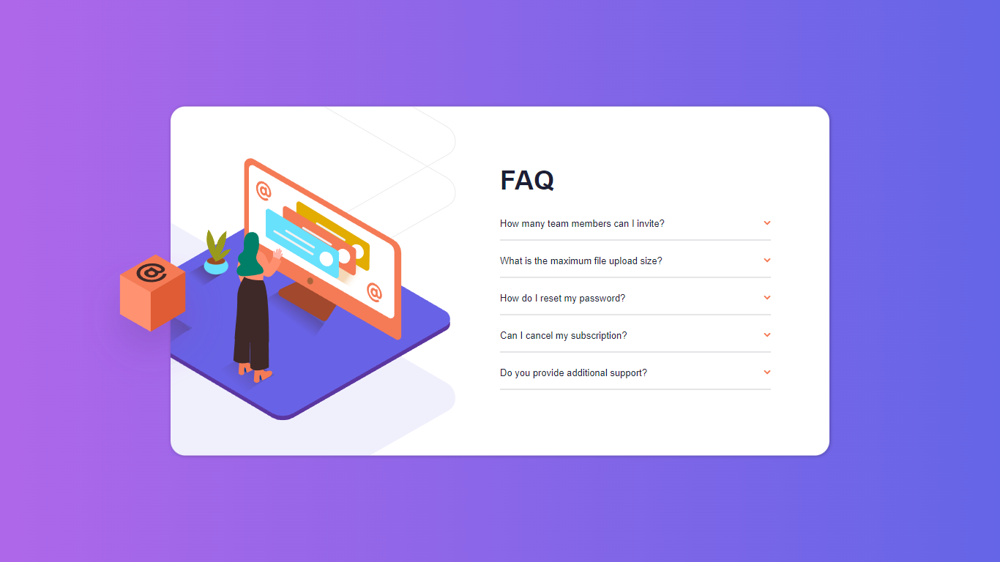
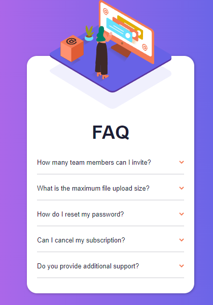

# Frontend Mentor - FAQ accordion card solution


### Screenshot





### Links

- Solution URL: [Add solution URL here]
- Live Site URL: [Add live site URL here]

## My process

### Built with

- Semantic HTML5 markup
- CSS custom properties
- Flexbox
- Mobile-first workflow


### What I learned

```js
const learned = () => {
  console.log('I learned how to fetch elements from a parent element through forEach.')
}
```


